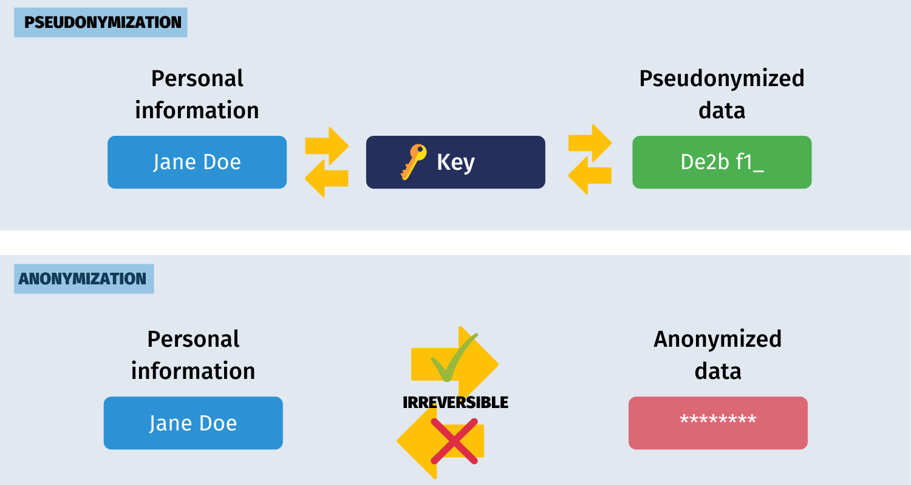

# Cloud Development Policy

## Purpose of this policy

## Scope of this policy

## Revision History / Schedule

## Cloud First Approach

## Acceptable Use for Cloud Technologies

### Consequences?

## Supported clouds for UKHO

### Azure

### AWS? (Only Data Science?)

### GCP

### Benefits of Multi-Cloud Approaches

## Network Security / Access Control Recommendations?

### Guidance on Security with the Hub and Spoke Model (See https://github.com/UKHO/how-do-i/blob/3373f41de95525cf795df0d9c1aae7ada2dcea86/docs/subscriptions.md?plain=1)

### Public Cloud Security Policy

### Hybrid Cloud Security Policy ??

### Private Cloud Security Policy ??

## Legal / Government Regulations Affecting Cloud Policy?

### See Cloud Security Principles from National CyberSecurity Center(https://www.ncsc.gov.uk/collection/cloud/the-cloud-security-principles)

### See Government Cloud First Policy (https://www.gov.uk/guidance/government-cloud-first-policy#government-cloud-principles)

### Statement of Current Regulatory Compliance?

## Recommendations for Container Hosting / Orchestration

## See Container Policy

### Never Run As Root

## Requirements and Recommendations for

### Auditing

### Testing

### Linting

### Virus Scanning

### Code Analysis

### Dependency Checking for Cloud Applications

### Infrastructure as Code - Terraform, etc

Terraform is UKHO's primary tool of choise for IaC and should be used for in all cases. Terraform provided multi-cloud provisioning and so is capable of deploying to any cloud provider. 

#### Setting up a new project
The Terraform deployment template found here: https://github.com/UKHO/Terraform-Deployment-Template should be used to ensure consistency when starting up any new project. Contact the DDC team if you have any questions. 

#### Networking
The DDC team are responsible for the creating and maintaining the networking spoke Terraform for each project. This is managed in a separate GitHub repository to the project terraform and can be found here: https://github.com/UKHO/Azure-Spokes

#### Modules 
The DDC team manages a collection of centralised Terraform modules found here: https://github.com/orgs/UKHO/teams/tfmodules/repositories
These should be used whenever possible. 

#### IaC Scanning (Trivy)
Trivy is UKHO's Chosen IaC Scanning tool. All Infrastructure pipelines should include a Trivy Scan stage before deployment that fails the build if misconfigurations or vulnerabilities are detected. 
A Trivy Stage is included in the previously mentioned Terraform deployment template: https://github.com/UKHO/Terraform-Deployment-Template/blob/5ca2e1c18618dad0df84ef8c08aea87a64c3b94e/azure-pipelines.yml#L37

### Secrets Management

### Microsoft Defender

## Deployment

## Security

## Data Use in the cloud

### SOLAS Requirements?

### Statement on personal / sensitive data

Personal Identifiable Information (PII) should only be held in accordance with the Data Protection Act 2018. 

PII should be minimised and/or anonymised in system logging. Where PII is required in logs, the PII should be pseudonymised.

### Data Protection Act and useful respources (Links)

- [An overview of the Data Protection Act 2018](https://ico.org.uk/media/for-organisations/documents/2614158/ico-introduction-to-the-data-protection-bill.pdf)
- [A guide to the data protection principles](https://ico.org.uk/for-organisations/uk-gdpr-guidance-and-resources/data-protection-principles/a-guide-to-the-data-protection-principles/)

### Georedundancy

Where possible, data should be georedundant. Some cloud services have this available out-of-the-box, such as Azure Storage Accounts, and others require setting up multiple resources and designating a primary and secondary 

### Data Sovereignty (UK datacentres only)

:thinking:

### Recommended / supported database solutions

WIP
- Support encypt at rest and transit

## Users
### User Management (Internal and External)

WIP
- use federated accounts over local accounts in each tenant.
- use access packages where appropriate
- External users should have a sponsor from the internal and external domains.

### Entra ID accounts over SAS / access keys / username/password connection strings

WIP
- use RBAC over connection strings and local accounts
- For SQL: Disable SA accounts and/or SQL login (use Entra ID login only)

## Disaster Recovery & Business Continuity

## Logging and Monitoring for Cloud-Based Deployments

### On-prem vs DDC-managed vs In-team ELK/EFK stacks, etc

## Training

### Requirements

### Recommendations

### Resources

### Cloud Pilot's License

## Incident Detection and Reporting

## Register of UKHO Security contacts and responsible persons

## Azure Policy for enforcement of configuration

## Tagging

Applied policies require the following tags on resources:
- SERVICE
- ENVIRONMENT
- COST_CENTRE
- SERVICE_OWNER
- RESPONSIBLE_TEAM
- CALLOUT_TEAM

Possible to use terraform `ignore_changes = [tags]` in which case tags will be inherited from resource hierarchy.

Should tags be deleted they will reapply with values from resource hierarchy.

Tag values can be changed and retained.

Tags should be kept current.

## Security Clearance

View Security Clearance policies here: 
https://github.com/UKHO/docs-private/tree/main/software-engineering-policies/CloudDevelopment/Security%20Clearance

## Related Information/Notes

### Nautilus Account Types & Purposes - https://ukho.sharepoint.com/sites/SoftwareDevandTest/SitePages/Account-types.aspx

### Code Review Policy - https://github.com/UKHO/docs/blob/main/software-engineering-policies/CodeReview/CodeReviewPolicy.md

### Container Policy - https://github.com/UKHO/docs/blob/main/software-engineering-policies/Containers/ContainerPolicy.md
